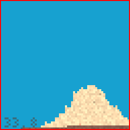

# Chunks

> NAMESPACE: Volume



Chunks work in a similar way to the popular hit game *Minecraft*. Each chunk holds a 2D array of voxels. The chunk is responsible for managing its voxels

They have their own Box2D meshes, manage their own GPU simulation and rendering data, etc

A lot of methods are called directly by the `ChunkMatrix` managing them. You shouldn't have to mess with them too much out of the box

# ChunkMatrix


ChunkMatrix is a class built for managing and interacting with chunks in a simple way. It's one of the most important classes in the whole engine. It can be compared to a world or a level in other engines. To simplify working with individual voxels in the game, you should use `Volume::VoxelElement* ChunkMatrix::VirtualGetAt(Vec2i, bool)` and `void ChunkMatrix::VirtualSetAt(Vec2i, bool)` to interact with voxels individually. They are called *Virtual* since they act like if you were accessing a 2D array that hosts all the voxels in the ChunkMatrix, even though it is not. They also have *_NoLoad* and *_NoDelete* variation, which are used for more fine-tuned control

NoLoad means that it won't load any new chunks by itself. If a chunk at that location isn't loaded, you just get an empty pointer

NoDelete is a bit more dangerous. You override the voxel at that position, replacing it with a new one, **but** the pointer of the previous voxel **is not** deleted. Any reference to that pointer is still valid until deleted by **you** or until it is returned to the ChunkMatrix's control

> [!IMPORTANT]  
> Use `void ChunkMatrix::VirtualSetAt_NoDelete(Vec2i, bool)` with caution. Failing to do so **will** generate memory leaks in your application, which **will** pile up in an unexpectedly short time

Currently the ChunkMatrix is only a single class inside the `GameEngine` object. In the future (or currently, if I forgot to update this doc) I will want to make the ChunkMatrix a pointer, which will allow swapping them during runtime. It would be like loading a new level or world in any other engine

Before running the engine you are expected to set the `Volume::Chunk* ChunkMatrix::ChunkGeneratorFunction(const Vec2i&, ChunkMatrix&)`. This function is called when generating any chunk in that ChunkMatrix and you are expected to fill that chunk with voxels using `Volume::VoxelElement* CreateVoxelElement(...)` and `Volume::VoxelElement* Volume::Chunk::voxels[][]`

An example of basic implementation for `Volume::Chunk* ChunkMatrix::ChunkGeneratorFunction(const Vec2i&, ChunkMatrix&)`:
```cpp
Volume::Chunk* GenerateChunk(const Vec2i &chunkPos, ChunkMatrix &chunkMatrix){
    Volume::Chunk* chunk = new Volume::Chunk(chunkPos);
    for(int x = 0; x < Volume::Chunk::CHUNK_SIZE; ++x){
        for(int y = 0; y < Volume::Chunk::CHUNK_SIZE; ++y){
            chunk->voxels[y][x] = CreateVoxelElement(
                "MyElement",
                Vec2i(
                    x + chunkPos.x * Volume::Chunk::CHUNK_SIZE, 
                    y + chunkPos.y * Volume::Chunk::CHUNK_SIZE
                ),
                20.0f,
                Volume::Temperature(21.0f),
                true
            );
        }
    }
    return chunk;
}
// Game is a class inheriting from IGame
void Game::OnInitialize()
{
    GameEngine::instance->chunkMatrix.ChunkGeneratorFunction = GenerateChunk;
}
```

> [!IMPORTANT]  
> Without setting `Volume::Chunk* ChunkMatrix::ChunkGeneratorFunction(const Vec2i&, ChunkMatrix&)`, the GameEngine will throw an error during any attempt to generate a chunk. You **must** set it before any chunk generation can happen to prevent crashes