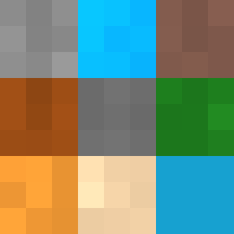
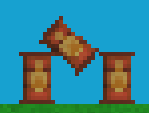
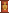

# Registries

> NAMESPACE: Registry

Registries handle the definition of Voxel and VoxelObject types before the game starts. The registries can only be expanded during their designated time window, not during the main game loop

## VoxelRegistry



During `void IGame::RegisterVoxels()`, you are required to register all relevant data for voxels that are going to be present inside the game

### Textures

When a voxel is spawned, its color is randomized a bit to have a small variation. This can be overridden using a texture

You can register a texture as follows:

```cpp
Registry::VoxelRegistry::RegisterTextureMap("TextureGameName", "BMPTextureFileNameOrPath", Registry::TextureRotation::Any);
```

`enum Registry::TextureRotation` corresponds to how the texture can be rotated. If you want the texture to be just identically repeating, then you can set it to `None`. But if your texture allows flipping it vertically or horizontally (or both), you can set it respectively

### Voxels

You have to set voxels using the `void Registry::VoxelRegistry::RegisterVoxel(std::string id, Volume::VoxelProperty)`. An example may look like the following:

```cpp
Registry::VoxelRegistry::RegisterVoxel(
    "Water",
    Registry::VoxelBuilder(Registry::DefaultVoxelConstructor::LiquidVoxel, 4186, 0.6f, 2)
        .SetName("Water")
        .SetColor(RGBA(3, 169, 244, 200))
        .PhaseDown("Ice", Volume::Temperature(0))       // Optional
        .PhaseUp("Steam", Volume::Temperature(99.98))   // Optional
        .SetFluidDispersionRate(10)
        .Build()                                        // Required at the end of `Registry::VoxelBuilder`
);
```

The `PhaseUp` and `PhaseDown` refer to the voxel "melting" or "solidifying" into a different element based on temperature. This does not require the voxel to have a different state. For example, you can make grass "melt" into dirt at high enough temperatures

#### Using textures

You can use the already registered textures using `.VoxelTextureMap("TextureGameName", false)`

The `false` specifies that we are overriding the random voxel hue shifts. If you want to keep them and overlay them over the texture, set it to `true`.

#### Constructor factory override

You won't always want a voxel to have the default behavior, but you may want to expand it or make your own. This is why the constructor factory override exists

An example of such an override may look like the following:

```cpp
Registry::VoxelRegistry::RegisterVoxel(
    "Fire",
    Registry::VoxelBuilder(Registry::DefaultVoxelConstructor::Custom, 100, 0.4, 1)
        .SetName("Scary fire")
        .SetColor(RGBA(255, 87, 34, 210))
        .PhaseDown("Carbon_Dioxide", Volume::Temperature(200))
        .SetFluidDispersionRate(5)
        .Build()
);
Registry::VoxelRegistry::RegisterVoxelFactory(
    "Fire",
    [](Vec2i position, Volume::Temperature temp, float amount, bool placeUnmovableSolids) {
        return new Volume::MyFireVoxel(position, temp, amount);
    }
);
```

The following code expects the voxels and factories' IDs to match. If you want to use a factory with a different name (e.g., reuse an existing one), you can use `.SpecialFactoryOverride(std::string)`, where the `std::string` corresponds to the factory ID that will be used

> ![NOTE]
> No override will ever happen unless you set the `Registry::DefaultVoxelConstructor` to `Custom`. Also, you must have a valid factory for all custom voxels

#### Inertia resistance

Inertia resistance is a behavior only used for solids. It is a value between 0 and 1. The bigger the value, the more the solid resists being moved. It can make movable solids feel more "clumped" and break off in groups instead of always forming a perfect pyramid

It can be set using `.SetSolidInertiaResistance(float)`

#### Fluid dispersion rate

Fluid dispersion rate is a value used by gases and liquids. It is a `uint8_t` value (0-255). The bigger the value, the more rapid the fluid movement. It can make the liquid feel more "viscous" and gases feel quicker

It can be set using `.SetFluidDispersionRate(uint8_t)`

#### Chemical reactions

You may want voxels to chemically interact together, such as iron oxidizing, salt and water creating sea water, and much more. Doing that via the `bool Volume::VoxelElement::Step(ChunkMatrix&)` would be very computationally expensive. This provides a GPU-accelerated way to add reactions with little to no performance impact

There are two ways to add chemical reactions. There is `.Reaction(...)` and `.ReactionOxidation(...)`. The first one simply creates a single reaction as specified, while the second one generates several that are specifically for oxidation, which makes it react to the specified element at different speeds based on if it's touching oxygen, water, or liquid oxygen

If you use `.ReactionOxidation(...)`, it is expected that you define voxels for the following IDs:
- Oxygen
- Liquid_Oxygen
- Water
- Steam

An example with both reactions:

```cpp
VoxelRegistry::RegisterVoxel(
    "Iron",
    VoxelBuilder(DefaultVoxelConstructor::SolidVoxel, 450, 5, 7874)
        .SetName("Untreated Iron")
        .SetColor(RGBA(130, 130, 130, 255))
        .ReactionOxidation("Rust", 0.0001f)
        .Reaction("Gold", "Philosophers_Stone", 0.03f, true, Temperature(100))
        .PhaseUp("Molten_Iron", Temperature(1538))
        .SetSolidInertiaResistance(0.95f)
        .Build()
);
```

## VoxelObjectRegistry



During `void IGame::RegisterVoxelObjects()`, you are required to register all relevant data for voxel objects that are going to be present inside the game

An example of registering an object looks like the following:

```cpp
VoxelObjectRegistry::RegisterVoxelObject(
    "Barrel",
    VoxelObjectBuilder(VoxelObjectType::PhysicsObject)
        .SetDensityOverride(400.0f)     // Optional, density is calculated automatically when not overridden
        .SetVoxelFileName("Barrel")
        .Build()
);
```

This code will expect a `Barrel.bmp` and `Barrel.mat.bmp` to be present in the `Textures` folder during build

> [!CAUTION]  
> Both `*.bmp` and `*.mat.bmp` **have** to be present and both **have** to have the same width and height. This is not optional

### Barrel.bmp



This is the visual texture for the object. It controls the "looks"

### Barrel.mat.bmp


This is the material texture for the object. For example, the barrel is entirely made out of metal (which is red). With this, you can make parts of the object have different material than others. Better tools for controlling these textures will be made later

So far, the colors are set to this (this **will** be changed later):

Format: 0xAARRGGBB

0xFFFF0000 -> Iron

0xFFFFFF00 -> Gold

0xFF964B00 -> Wood

0xFF00FF00 -> Rust

0xFF0000FF -> Stone

0xFFFFFFFF -> Glass

0xFF000000 -> Charcoal

0xFFFFA500 -> Organics

Be careful not to use colors outside this range and not to use a color for which you have not defined a voxel with that ID

### Constructor factory override

You won't always want an object to have the default behavior, but you may want to expand it or make your own. This is why the constructor factory override exists

An example of such an override may look like the following:

```cpp
VoxelObjectRegistry::RegisterVoxelObject(
    "Crate",
    VoxelObjectBuilder(VoxelObjectType::Custom)
        .SetVoxelFileName("Crate")
        .Build()
);
Registry::VoxelObjectRegistry::RegisterVoxelObjectFactory(
    "Crate",
    [](Vec2f position, const std::vector<std::vector<VoxelData>>& voxelData, std::string name) {
        return new Volume::MyCrateVoxelObject(position, voxelData, name);
    }
);
```

The following code expects the voxel objects and factories' IDs to match. If you want to use a factory with a different name (e.g., reuse an existing one), you can use `.SpecialFactoryOverride(std::string)`, where the `std::string` corresponds to the factory ID that will be used

> ![NOTE]
> No override will ever happen unless you set the `Registry::VoxelObjectType` to `Custom`. Also, you must have a valid factory for all custom voxels