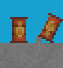
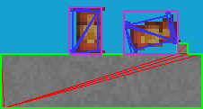

# VoxelObject

> VoxelObject

VoxelObjects represent groups of voxels that can be moved as a group and that are partly outside of the world simulation (they are not present in the 2D chunk arrays, they are simply overlaid)

It has an inner `std::vector<std::vector<Volume::VoxelElement*>> VoxelObject::voxels` array that stores all the voxels similar to a `Volume::Chunk`. There is also a `std::vector<std::vector<Volume::VoxelElement*>> VoxelObject::rotatedVoxelBuffer`, which stores the voxels as they appear in the world. This is mainly to account for rotation angle. The second array does not have to have all the voxels from the first one, as there is some loss when rotating to weird angles

The `VoxelObject` can be moved, rotated and interacted with (including its voxels) 

## PhysicsObject

> BASE_CLASS: VoxelObject

> PhysicsObject



The `PhysicsObject` is a class that is for interacting with Box2D simulations. When interacting with its voxels, the mesh is dynamically adjusted to fit that new shape

The object also has its density controlled by the type of voxels it is made out of (if not overridden). This means that a large cube of iron will weigh much more than a large cube of wood. And a small cube of iron will weigh less than a big cube of iron



## Creating an object

[REGISTRY_TUTORIAL]: Registries.md

First you will have to register the VoxelObject in the `Registry::GameObjectRegistry` (example in [Registries.md][README])

After that all you need is to call a `void Registry::CreateGameObject(std::string, Vec2f, ChunkMatrix*, GamePhysics*)`. This will insert a new clone of the object in registry into the world (and physics simulation if PhysicsObject)

An example to create an object with the ID "Barrel":
```cpp
Registry::CreateGameObject("Barrel", Vec2f(0, 0), &GameEngine::instance->chunkMatrix, GameEngine::physics);
```