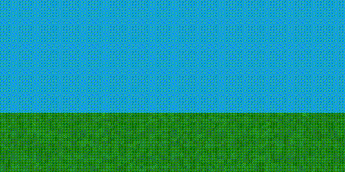
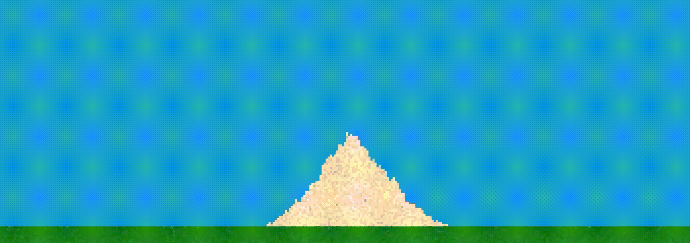

[README]: README.md

> [!NOTE]  
> Confused about why and what "voxels" are doing in a 2D game engine? Please refer to the note in [README.md][README]

# Voxels

> NAMESPACE: Volume

## Built-in voxel types

> BASE_CLASS: Volume::VoxelElement



The provided built-in voxel types are a basic selection of voxels made for simulations reminding of real life. If the selection does not fit your use case you are encouraged to expand the list in your own application by inheriting from the `Volume::VoxelElement` base class

The most important method is the `bool Volume::VoxelElement::Step(ChunkMatrix* matrix)` which may be called each voxel update. It must be overridden to implement any custom functionality like movement. It should return `true` if you expect the element to be also updated the next frame (e.g. if it moved this frame). Returning `false` does ***not** guarantee it won't be called again next or any other frame. You should also change the `bool Volume::VoxelElement::updatedThisFrame` to `true` to prevent the voxel from being updated more than once per frame

Basic implementation of a `MyVoxel` class. The following example will make a voxel that falls straight down until it encounters something solid. After that it deletes itself
```cpp
class MyVoxel : public VoxelElement{
    // defines that the voxel is a solid for other voxels. Not a liquid or gas
    State GetState() const override { return State::Solid; }; 

    // defines that the voxel will change the collider mesh of the voxel it is in for physics simulations when moved
    bool ShouldTriggerDirtyColliders() const override { return true; }; 

    // defines that the voxel will be part of that mesh. For eg. it wouldn't make sense to generate a solid mesh for liquids or gases
    bool IsSolidCollider() const override { return true; };

	bool Step(ChunkMatrix* matrix) override;
}

bool Volume::MyVoxel::Step(ChunkMatrix* matrix){
    Vec2i positionBelow = this->position + vector::DOWN;
    Volume::VoxelElement* voxelBelow = matrix->VirtualGetAt(positionBelow);

    if(voxelBelow && voxelBelow->GetState() != Volume::State::Solid){ // Voxel below is not solid
        // Swap with the voxel below
        this->Swap(positionBelow, *matrix);
        return true;
    }
    else{ // Voxel below is a solid (or non-existent)
        // Change this voxel for a voxel with id "Empty"
        this->DieAndReplace(*matrix, "Empty");
        return true;
    }

    return false;
}
```

### Solid voxel

> Volume::VoxelSolid

Works as the ground, sand or any other generally solid substance in sand falling simulations. It has an important member variable called `bool Volume::VoxelSolid::isStatic` which makes the voxel either static (like the ground) or moving (like sand)

### Liquid voxel

> Volume::VoxelLiquid

Simple liquid class. Tries to fill in any available space formed by `Volume::VoxelSolid`. It tries to force itself to have the same `float Volume::VoxelElement::amount` as a static variable `uint16_t Volume::VoxelLiquid::DesiredAmount` which is set to 20

If the `float Volume::VoxelElement::amount` goes to 0 or below it is replaced by a `Volume::EmptyVoxel`

Liquids sort themselves by density

### Gas voxel

> Volume::VoxelGas

Tries to fill any space not filled by `Volume::VoxelSolid` or `Volume::VoxelLiquid`. If they reach amount (pressure) below static member variable `double Volume::VoxelSolid::MinimumGasAmount` which is set to 1e-7f they get replaced by a `Volume::EmptyVoxel`

Gases will sort themselves by density

### Empty voxel

> Volume::EmptyVoxel

Empty voxel is the only pre-registered voxel type available. Chunks can **not** have a null pointer inside their voxel 2D arrays, they expect to be always full with actual elements. This gives a purpose for the empty voxel element where you can use it instead of `nullptr` to prevent your application from crashing but also defining an empty space. The voxel does not move nor interacts with anything except when trying to find any gases to fill its space

It is also spawned when a `Volume::VoxelGas` reaches a low enough pressure (amount) and replaces the gas

This "element" has zero density, heat conductivity and heat capacity. It is also fully transparent

## Particles

> NAMESPACE: Particle

> BASE_CLASS: Particle::VoxelParticle

Particles have their own separate storage that it not connected to the 2D voxel array or to any chunk. They are instead tied to a `ChunkMatrix`'s particles vector. They have their own `bool Particle::VoxelParticle::Step(ChunkMatrix *matrix)` function, which should return true when the particle should be deleted. It is recommended but not forced to use the `bool Particle::VoxelParticle::ShouldDie() const` as a return value or for a check so the particle gets deleted when needed.

The particle's step function is called in the voxel simulation thread after preforming the cellular automata step. The Step function is to update the `Vec2f Particle::VoxelParticle::position` member variable for any movement with additional checks. You can use `Volume::VoxelElement* ChunkMatrix::VirtualGetAt(Vec2i, bool)`, `void ChunkMatrix::VirtualSetAt(Vec2i, bool)` and `void ChunkMatrix::PlaceVoxelAt(...)` to interact with the world.

Minimal step function may look like the following:
```cpp
bool MyCustomParticle::Step(ChunkMatrix *matrix)
{
    // falls staight down, ignoring everything. 1 voxel per `GameEngine::voxelFixedDeltaTime`
    this->position += vector::DOWN;

    // reduce lifetime each update to make the particle die off after a predefined time
    if(!isTimeImmortal)
        this->particleLifeTime--;

    return this->ShouldDie();
}
```

Each particle is rendered on the top most layer of the rendering step.

### Solid Falling Particle

> Particle::SolidFallingParticle



This particle is a predefined functional class for having solid voxels thrown around and fly though the air. They hold a pointer to a `Volume::VoxelElement` inside and they fall utilizing gravity. When they land (or fly for too long), they die and spawn a voxel into the world based on the voxel inside `Volume::VoxelElement* Particle::SolidFallingParticle::voxel`. They are used for example when making explosions a bit more realistic.
